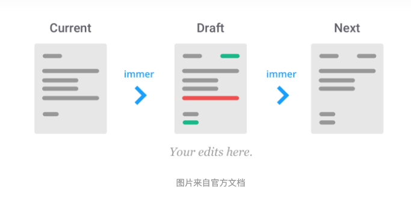

- 当我们调用 immer 的 API produce时，immer 将内部暂时存储着我们的目标对象（以 state 为例）
- immer 暴露一个 draftState （草稿）给我们
- 我们在 draftState 上作修改
- immer 接收修改后的draftState，immer 基于传入的 state 照着draft 的修改 返回一个新的 state

```js
this.setState((prevState) => {
  return produce(prevState, draftState =>{
    draftState.address.city.area = 'JingAn';
    draftState.address.city.postcode = draftState.address.city.postcode + 10;
  });
})

=> 

this.setState(produce(draftState => {
  draftState.address.city.area = "JingAn";
  draftState.address.city.postcode = draftState.address.city.postcode + 10;
}));
```


refs:

https://zhuanlan.zhihu.com/p/146773995
