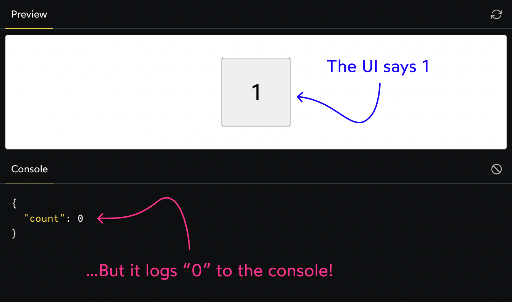

##### 条件判断
错误写法
```jsx
<div>
  {items.length && <ShoppingList items={items} />}
</div>
```
正确写法
```jsx
<div>
  {items.length > 0 && (
	<ShoppingList items={items} />
  )}
</div>
```

##### Mutating state
错误写法
```js
items.push(value);
setItems(items);
```
正确写法
```js
const nextItems = [...items, value];
setItems(nextItems);
```

##### 唯一key
错误写法
```js
{items.map((item, index) => {
	return (
	  <li key={index}>{item}</li>
	);
})}
```
正确写法
```js
function handleAddItem(value) {
  const nextItem = {
    id: crypto.randomUUID(),
    label: value,
  };
  const nextItems = [...items, nextItem];
  setItems(nextItems);
}

{items.map((item, index) => {
	return (
	  <li key={item.id}>
		{item.label}
	  </li>
	);
})}
```

##### state更新后，log输出错误

错误写法
```js
function handleClick() {
  setCount(count + 1);
  console.log({ count });
}
```
正确写法
```js
function handleClick() {
  const nextCount = count + 1;
  setCount(nextCount);
  console.log({ nextCount });
}
```

#### 回调无法获取最新的state数据（对象类型）
https://legacy.reactjs.org/docs/state-and-lifecycle.html#state-updates-may-be-asynchronous
```js
// 错误写法
function handleClick() {
  setCount({
    ...values,
    keyX: valueX
  });
  console.log({ count });
}

// 正确写法
function handleClick() {
  setCount((pre) => ({
	 ...pre,
	 keyX: valueX
  }))
}
```
##### 缺少样式括号
错误写法
```jsx
<button style="color: red; font-size: 1.25rem">
  Hello World
</button>
```
正确写法
```jsx
const btnStyles = { color: 'red', fontSize: '1.25rem' };

<button style={btnStyles}>
  Hello World
</button>
```

```jsx
<button style={{ color: 'red', fontSize: '1.25rem' }}>
```

##### useEffect中使用await
错误写法
```jsx
// useEffect参数不能为一个promise
useEffect(async () => {
    const res = await fetch('xxxxx');
    const json = await res.json();
    
    setUser(json.user);
}, [userId])
```
正确写法
```jsx
useEffect(() => {
  const update = async () => {
    const res = await fetch('xxxxx');
    const json = await res.json();
    setUser(json);
  }
  
  update();
}, [userId])
```


ref:
https://www.joshwcomeau.com/react/common-beginner-mistakes/#async-effect-function-9
