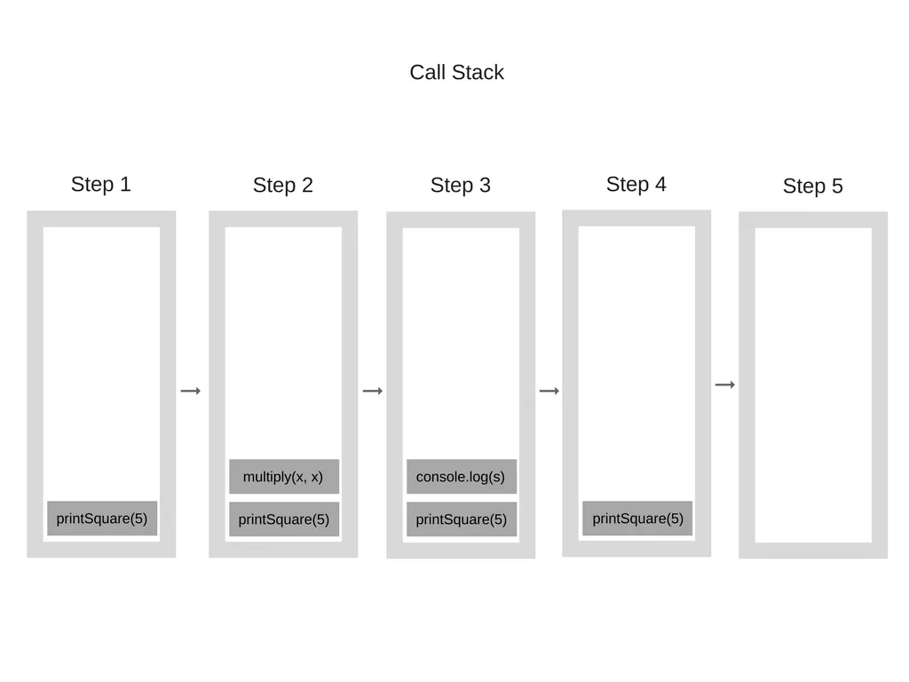
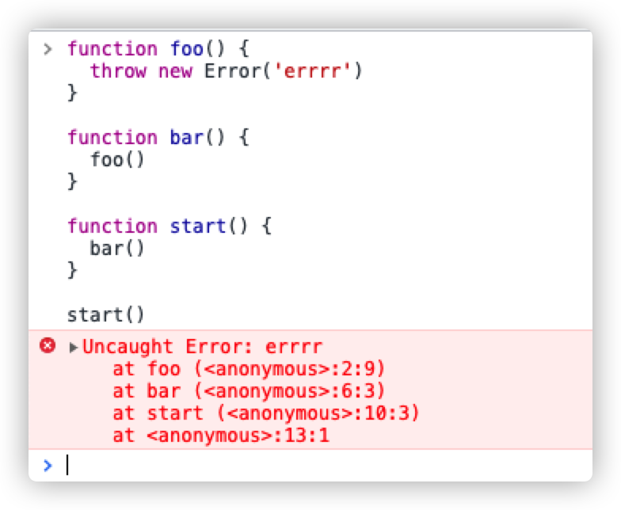
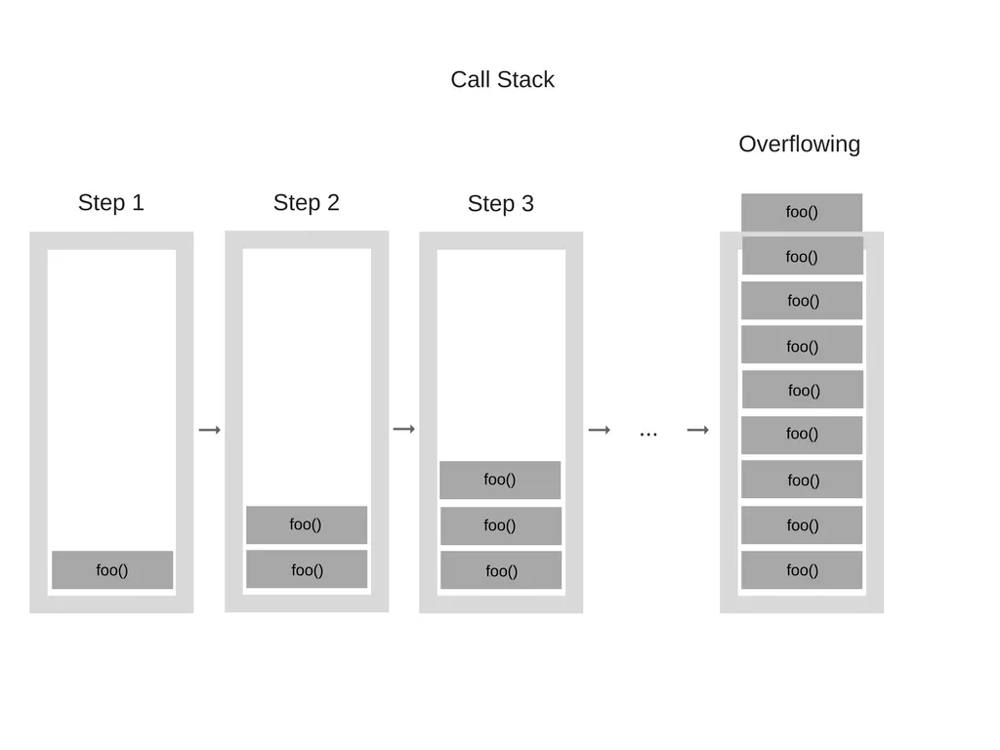

JavaScript是单线程的编程语言，这意味着它只有一个调用栈，一次做一件事情

调用栈是一种数据结构，里面会记录我们在程序中的大概位置。

当执行进入一个函数，把它置于栈的顶部。如果从函数中返回则从栈顶部移除函数。遵循先进后出的原则

##### 普通调用栈

```javascript
function multiply(x, y) {
   return x * y
}

function printSquare(x) {
  const s = multiply(x, x)

  console.log(s);
}

printSquare(5)
```



##### 异常栈追踪

```javascript
function foo() {
  throw new Error('errrr')
}

function bar() {
  foo()
}

function start() {
  bar()
}

start()
```



##### 堆栈溢出：调用栈中的函数调用次数超过了调用栈的实际大小

```js
function foo() {
  foo()
}

foo()
```


