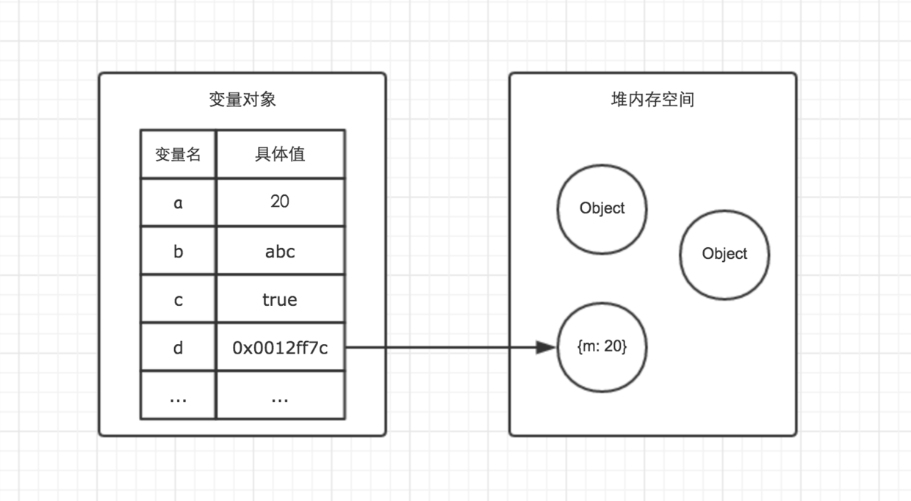
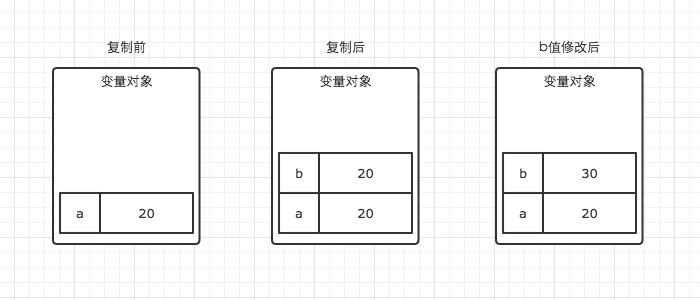
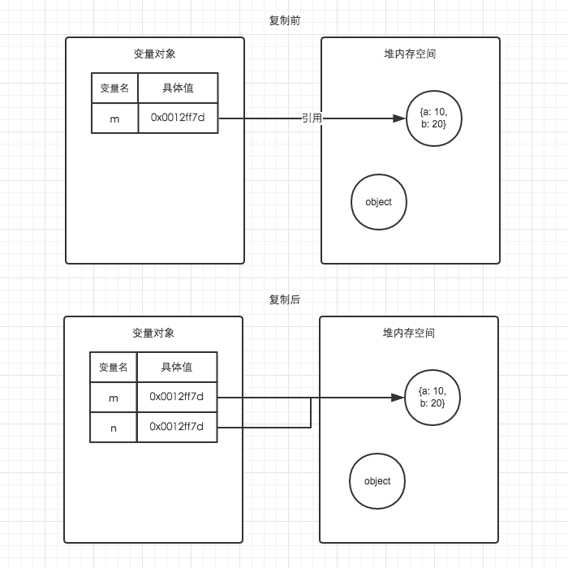

> Js中的变量类型传递方式，分为**值类型**和**引用类型**，值类型变量包括 Boolean、String、Number、Undefined、Null，引用类型包括了 Object 类的所有，如 Date、Array、Function 等。在参数传递方式上，值类型是按值传递，引用类型是按共享传递。


##### 栈内存

- 一般都是已知大小或者有范围上限的简单存储
- 基本类型：number、string、boolean、null、undefined、对象变量的指针

```js
var a = 20;
var b = a;
b = 30

console.log(a);
console.log(b);

// 20
// 30
```

##### 堆内存

- 主要负责复杂对象的存储

```javascript
var m = { a: 10, b: 20 }
var n = m;
n.a = 15;

console.log(m.a)
console.log(n.a)

// 15
// 15
```


##### 堆栈内存区别



##### 栈内存修改



##### 堆内存复制的为地址引用



