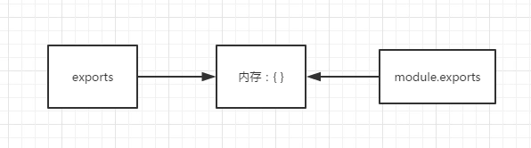

##### CommonJS

- 一般指Node.js的版本
  - 后期browserify可以将CommonJS模块打包为浏览器可以运行的文件
- 每个文件是一个模块，每个模块有独立的作用域
- 通过require方法来**同步**加载依赖的其他模块，意味着阻塞加载
- module对象有loaded属性，用来记录模块是否被加载过
  - 第一次加载、执行后会被设置为true，然后运行结果被缓存
  - 再次加载，将不会执行模块代码，直接读取缓存结果

##### 缺点

无法直接运行在浏览器环境下，必须通过工具转换

##### exports与module.exports区别




```js
exports = module.exports = {}

相当于

var module = {
	exports: {}
}
var exports = module.exports
```

```javascript
exports.a = 1
exports.b = 2
module.exports.c = 3

输出{ a: 1, b: 2, c: 3 }
```

###### exports只能添加属性，不能直接赋值，否则会失效（因为赋值指向了新对象）

```javascript
exports.a = {
	a: 1
}

//输出{ a: { a: 1 } }

exports = {
 a: 1
}
exports.b = 2;

//输出{}
```

###### 避免module.exports、exports不恰当的混用

```javascript
// mod.js
exports.a = 1
module.exports = {
    b: 2
}
module.exports.c = 3

// mod.js
module.exports = {
    b: 2
}
exports.a = 1
module.exports.c = 3


均输出{ b: 2, c: 3 }
```

