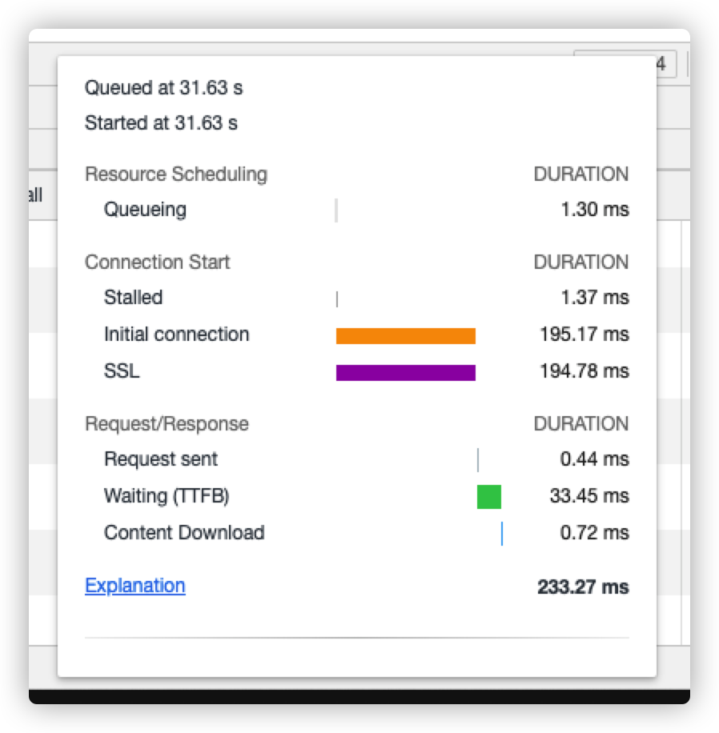

##### 服务器

- 吞吐量 Queries per second
  - 最基本的性能指标，每秒请求数
- 并发数 concurrency
  - 负载能力，能够同时支持的客户端数量
- 响应时间 time per request
  - 处理能力，时间越短越好
- CPU、内存、硬盘、网卡、etc
  - 使用率

##### 服务器性能测试工具

- ab
- linux自带工具
  - top
    - 查看CPU、内存占用情况
  - netstat

##### 客户端

- 降低延迟
  - 地理因素
  - 带宽
    - 不同运营商、不同类型的网络（内部、4g、etc）
  - DNS查询
  - TCP握手

- Queued、Queueing
  - 浏览器对域名最大并发限制，导致的排队等待时间
- Stalled
  - 浏览器分配、调度时间
- Initial connection、SSL
  - 建立连接时间
- Request sent
  - 向服务器发送数据耗时
- Waiting (TTFB)	
  - 服务器首字节响应时间
    - 服务器处理时间 + 网络传输时间
- Content Download	
  - 接受数据时间
