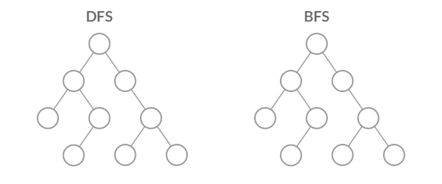

#### 深度优先遍历(Depth First Search)
从根节点出发，按照从左到右的顺序，访问子节点，如果子节点还有子节点，则一直向下访问，直到没有子节点为止。

然后再返回到离根节点最近的而没有访问到的子节点，然后按照前面的查找方法，一遍一遍的循环下去，直到所有的节点被访问完毕为止

有爆栈的风险

#### 广度优先遍历(Breadth First Search)
从根节点出发，一层一层的从上向下访问，同层节点从左往右访问，直到所有的节点都被访问到为止

广度优先相比深度优先，可以更快地找到最短路径，但在空间占用上通常比深度优先更高

##### 应用场景
最短路径，查找最大、最小值


#### 示例
树形结构，通过id值查找该元素，并返回相应路径
```json
const sample = [
    {
        id: 1,
        name: 1,
        children: [
            {
                id: 11,
                name: 11,
                children: [
                    {
                        id: 111,
                        name: 111,
                        children: [
                            {
                                id: 1111,
                                name: 1111,
                                children: [
                                    {
                                        id: 11111,
                                        name: 11111,
                                        children: [],
                                    },
                                ],
                            },
                        ],
                    },
                ],
            },
        ],
    },
    {
        id: 2,
        name: 2,
        children: [
            {
                id: 22,
                name: 22,
                children: [],
            },
        ],
    },
    {
        id: 3,
        name: 3,
        children: [
            {
                id: 33,
                name: 33,
                children: [
                    {
                        id: 333,
                        name: 333,
                        children: [],
                    },
                ],
            },
        ],
    },
]
```
##### 深度遍历
```js
function getPathById(tree, id) {
	const result = []
	function findPath(node) {
		console.log(node, '=-=-');
		if (node.id === id) {
			result.push(node.id)
			return true
		}
		
		if (node.children && node.children.length) {
			for (let i = 0; i < node.children.length; i++) {
				const target = node.children[i]

				if (findPath(target)) {
					result.push(node.id)
					return true
				}
			}
		}
		return false
	}

	for (let i = 0; i < tree.length; i++) {
		if (findPath(tree[i])) {
			break
		}
	}

	return result.reverse()
}

console.log(getPathById(sample, 333))

output:

> {id: 1, name: 1, children: Array(1)} 'current node'
> {id: 11, name: 11, children: Array(1)} 'current node'
> {id: 111, name: 111, children: Array(1)} 'current node'
> {id: 1111, name: 1111, children: Array(1)} 'current node'
> {id: 11111, name: 11111, children: Array(0)} 'current node'
> {id: 2, name: 2, children: Array(1)} 'current node'
> {id: 22, name: 22, children: Array(0)} 'current node'
> {id: 3, name: 3, children: Array(1)} 'current node'
> {id: 33, name: 33, children: Array(1)} 'current node'
> {id: 333, name: 333, children: Array(0)} 'current node'
> (3) [3, 33, 333]
```

##### 广度遍历
```js
function getPathById(tree, id) {
    const queue = []
    const parentMap = {}

    // 第一层
    for (let i = 0; i < tree.length; i++) {
        queue.push(tree[i])
        parentMap[tree[i].id] = null
    }

    while (queue.length) {
        const node = queue.shift()

        console.log(node, 'nodenode');
        if (node.id === id) {
            // 找到目标对象
            const result = [node.id]
            let parent = parentMap[node.id]

            // 从map中向上查找父元素id，直到顶层null
            while (parent !== null) {
                result.unshift(parent)
                parent = parentMap[parent]
            }
            
            // 返回结果
            return result
        }

        // 有子节点
        if (node.children && node.children.length) {
            for (let i = 0; i < node.children.length; i++) {
                // 插入队列
                queue.push(node.children[i])
                // map上保存相关记录
                parentMap[node.children[i].id] = node.id
            }
        }
    }
    return []
}

console.log(getPathById(sample, 333))

output：

> {id: 1, name: 1, children: Array(1)} 'current node'
> {id: 2, name: 2, children: Array(1)} 'current node'
> {id: 3, name: 3, children: Array(1)} 'current node'
> {id: 11, name: 11, children: Array(1)} 'current node'
> {id: 22, name: 22, children: Array(0)} 'current node'
> {id: 33, name: 33, children: Array(1)} 'current node'
> {id: 111, name: 111, children: Array(1)} 'current node'
> {id: 333, name: 333, children: Array(0)} 'current node'
> (3) [3, 33, 333]
```

refs:
- https://zhuanlan.zhihu.com/p/136183284
- https://juejin.cn/post/6844903807759941646
