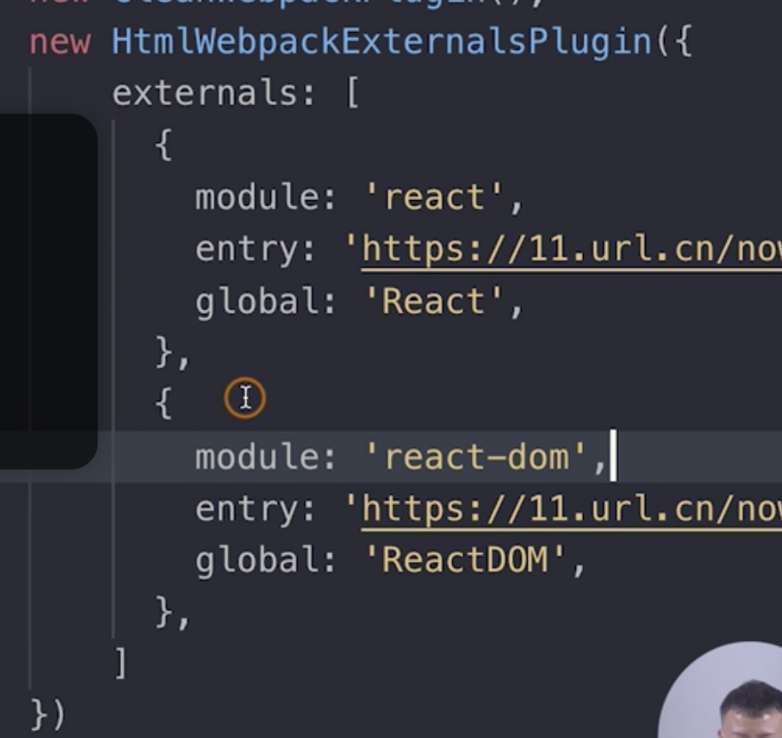
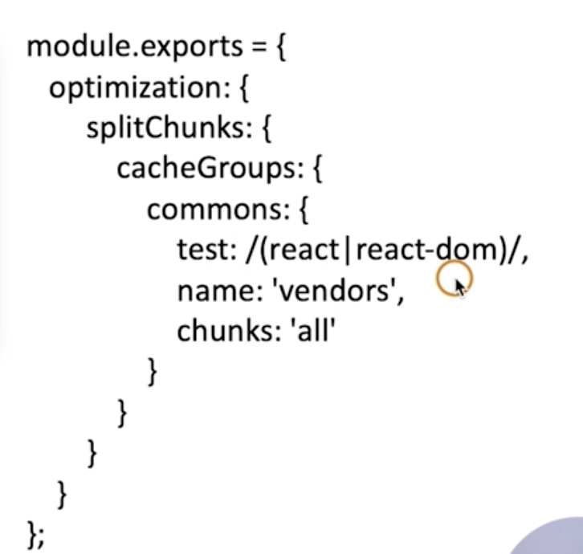
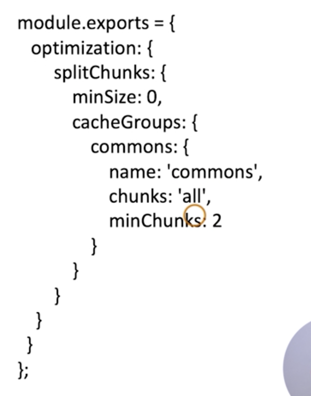

##### 查看编译耗时

- speed-measure-webpack-plugin

##### 利用缓存

缓存相关依赖、编译结果在node_modules

- babel-loader
- terser-webpack-plugin
- hard-source-webpack-plugin（模块缓存）

##### 缩小构建目标

- exclude：node_modules
- resolve
  - alias
    - 减少查找lib的时间（react、vue、etc）
  - extension
    - 只查找['.js']
  - mainFilelds
    - 只查找pkg.json的['main']字段

##### 基础库分离

不进行打包，走cdn

- htmlWebpackExternalsPlugin
  - 添加script到html
  
- splitChunks
  - 分离基础lib
  
  - 分离公共文件
  
  - 添加vendors到html

##### 定位体积较大的模块

webpack-bundle-analyzer（分析bundle）

##### 动态polyfill服务

polyfill.io

##### 使用本地磁盘文件缓存
```js
cache: {
	type: "filesystem"
}
```
