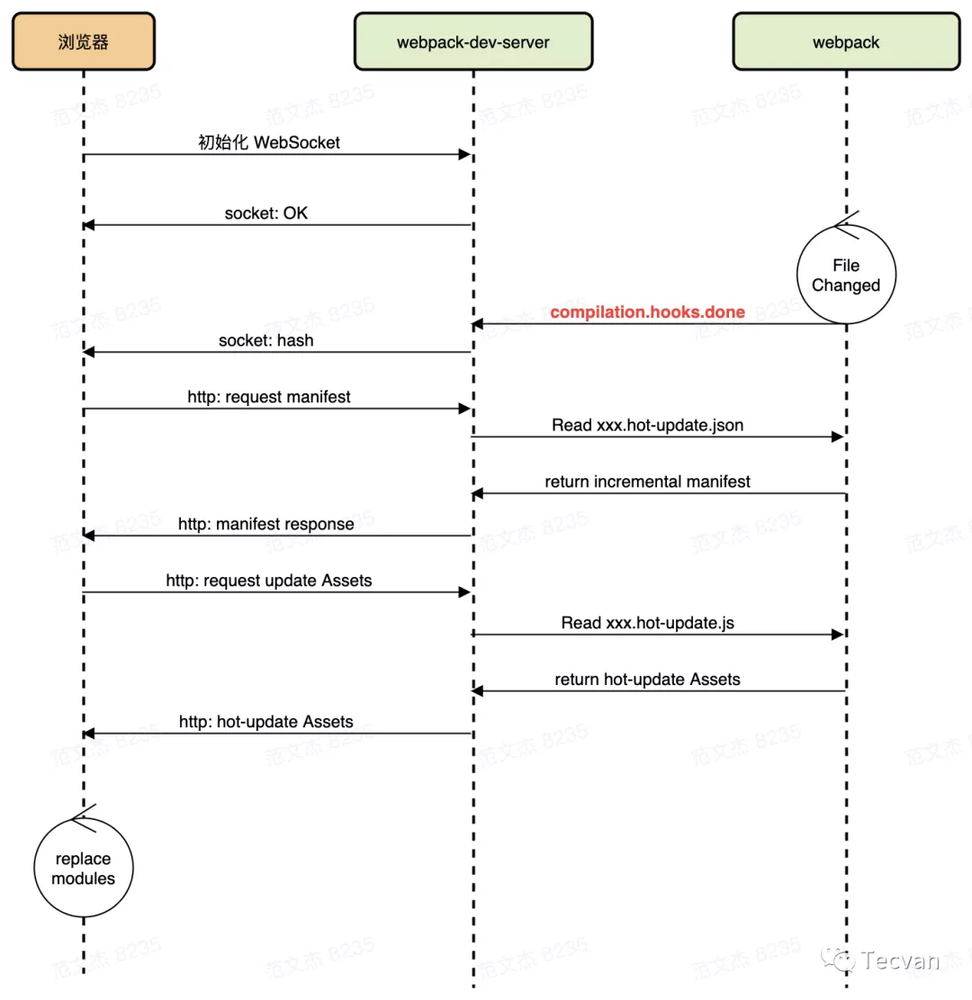

##### 开启HMR

###### plugins

```shell
plugins: [
	new webpack.HotModuleReplacementPlugin(),
],
```

###### devServer

```
// webpack.config.js
module.exports = {
  // ...
  devServer: {
    // 必须设置 devServer.hot = true，启动 HMR 功能
    hot: true
  }
}
```

###### 手动调用更新

- 通常不太需要对此过多关注，因为许多loader 已经提供了针对不同资源的 HMR 功能
  - react-hot-loader、vue-loader

```javascript
if (module.hot) {
	module.hot.accept()
}
```

##### 原理

- 使用 `webpack-dev-server` (后面简称 WDS)托管静态资源，WDS 调用 `HotModuleReplacementPlugin` 插件向应用的主 Chunk 注入一系列 HMR Runtime
- 浏览器加载页面后，与 WDS 建立 WebSocket 连接
- Webpack 监听到文件变化后，增量构建发生变更的模块，并通过 WebSocket 发送 `hash` 事件
- 浏览器接收到 `hash` 事件后，请求 `manifest` 资源文件，确认增量变更范围
  - `manifest` 文件
    - 包含所有发生变更的模块列表
      - [hash].hot-update.json
  - 模块变更文件
    - 包含编译后的模块代码
      - [hash].hot-update.js
- 浏览器加载完最新模块代码后，HMR 运行时会继续触发 `module.hot.accept` 回调，将最新代码替换到运行环境中




refs:

https://mp.weixin.qq.com/s/cbYMpuc4hnV9NA4VfqJLvg

