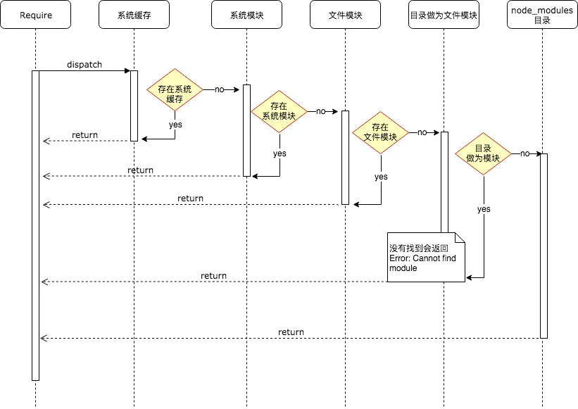

在模块加载机制中，NodeJs采用了延迟加载的策略，只有在用到的情况下，系统模块才会被加载

##### 模块分类

- 系统模块
  - 内建模块
    - 原生模块中，由纯 `C/C++` 编写
  - 原生模块
    - http、buffer、fs等，底层也是调用的内建模块
- 文件模块
  - 普通文件模块
    - js、json
  - `C++` 扩展模块
    - 编译之后扩展名为 `.node` 的模块

##### 加载顺序

- 尝试从缓存加载

- 原生模块
	- 启动时，部分核心模块已经加载到了内存中
    - 省去了路径分析、文件定位、磁盘io 
  
- 当作文件模块加载
  
  - 如果文件没有扩展名，会依次按照 `.js`、 `.json`、 `.node` 进行扩展名补足尝试
  - 加载过程中，发现是目录
    - 读取package.json，main字段
  
- 不是一个核心模块，也没有以 `'/'` 、 `'../'` 或 `'./'` 开头

  - 从当前模块的父目录开始，尝试从它的 `node_modules` 目录里加载模块

  - 如果还是没有找到，则移动到再上一层父目录，直到文件系统的根目录

    ```shell
    在 '/home/ry/projects/foo.js' 文件里调用了 require('bar.js')
    
    /home/ry/projects/node_modules/bar.js
    /home/ry/node_modules/bar.js
    /home/node_modules/bar.js
    /node_modules/bar.js
    ```



Ref:

http://nodejs.cn/api/modules.html#modules_loading_from_node_modules_folders

https://juejin.cn/post/6844903957752463374
